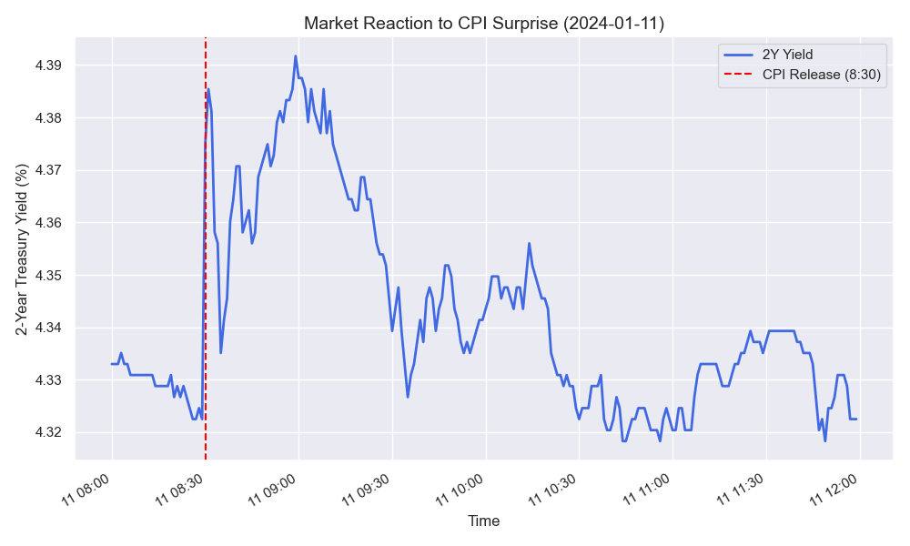
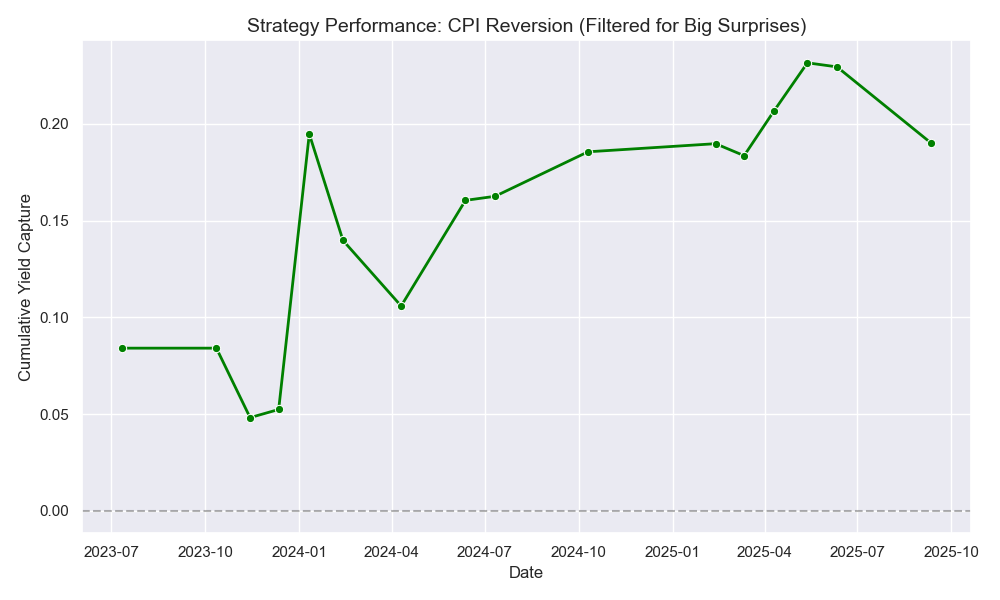

TODO: Review the "Optimization" section in `backtesting.ipynb`.

## Project Overview
This project analyzes the impact of economic events (CPI and Unemployment) on 2-Year and 10-Year Treasury Yields. We backtested intraday trading strategies to capitalize on the volatility following these releases.

*Figure 1: Example of 2-Year Yield reaction to a CPI surprise (Jan 11, 2024).*

## Key Findings
1.  **Trend Following vs. Reversion:**
    *   **Trend Following** (betting the initial move continues) generally **failed**.
    *   **Reversion** (fading the initial move) was historically profitable but has seen performance degrade in the last 18 months (flat PnL since Jan 2024).

2.  **The "Noise" Problem:**
    *   Trading every event leads to "churn" and losses on days with small data deviations.
    *   **Solution:** Filtering for **Significant Surprises** (e.g., `|Actual - Surveyed| >= 0.1%`) significantly improves the signal-to-noise ratio and restores profitability.

*Figure 2: Cumulative PnL of the Reversion Strategy when filtering for significant surprises.*

## Files Included
*   `economic_events_analysis.ipynb`: Initial data exploration and visualization of yield behavior around events.
*   `backtesting.ipynb`: The strategy engine. Contains the logic for Trend vs. Reversion and the "Significant Surprise" filter optimization.
*   `cleaned_cpi_data.csv` & `cleaned_unemployment_data.csv`: Processed intraday data used for the backtests.

