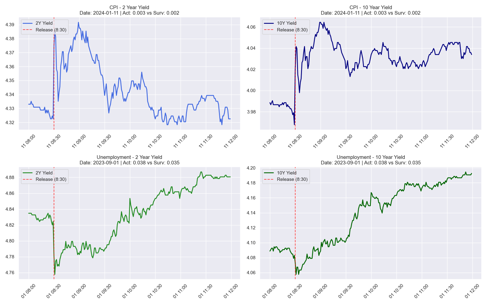
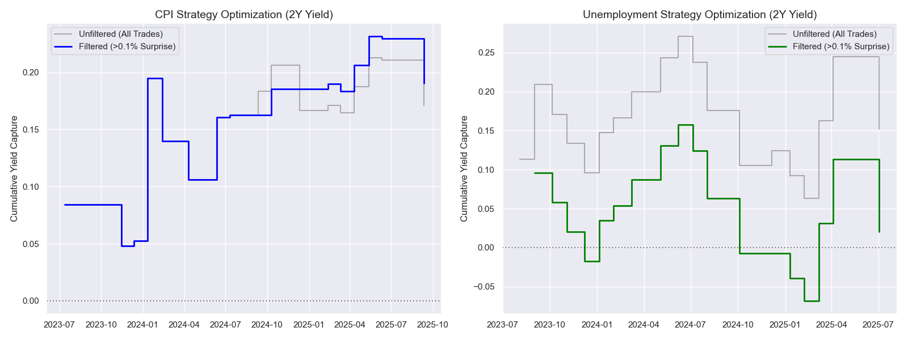

# TODO: Review the "Optimization" section in `backtesting.ipynb`.

## Project Overview
This project analyzes the impact of economic events (CPI and Unemployment) on 2-Year and 10-Year Treasury Yields. We backtested intraday trading strategies to capitalize on the volatility following these releases.


*Figure 1: Comparison of 2-Year and 10-Year Yield reactions to significant CPI and Unemployment surprises.*

## Key Findings

```text

==================== CPI Event - Reversion Strategy (2Y) ====================
STRATEGY LOGIC:
1.  Identify Event Bias: Did Actual beat Surveyed?
2.  Entry: 09:00 AM (approx 30 mins after release).
3.  Direction: REVERSION (Fade the move).
    - If Yields spiked UP (Hot Data), we SHORT Yields.
    - If Yields dropped DOWN (Cool Data), we LONG Yields.
4.  Exit: End of Trading Day (16:00 PM).
--------------------------------------------------
PERFORMANCE METRICS:
Total Trades          18
Win Rate           55.6%
Avg Win           0.0383
Avg Loss          0.0303
Profit Factor       1.81
Max Drawdown     -0.0889
Total PnL         0.1713
Sharpe Ratio        0.20
--------------------------------------------------
TRADE LOG:
      Date  Signal     PnL
2023-07-12      -1  0.0841
2023-10-12       1 -0.0000
2023-11-14      -1 -0.0359
2023-12-12       1  0.0042
2024-01-11       1  0.1424
2024-02-13       1 -0.0550
2024-04-10       1 -0.0339
2024-06-12      -1  0.0546
2024-07-11      -1  0.0021
2024-09-11       1  0.0207
2024-10-10       1  0.0230
2024-12-11       1 -0.0396
2025-02-12       1  0.0042
2025-03-12      -1 -0.0062
2025-04-10      -1  0.0229
2025-05-13      -1  0.0251
2025-06-11      -1 -0.0021
2025-09-11       1 -0.0393

==================== Unemployment Event - Reversion Strategy (2Y) ====================
STRATEGY LOGIC:
1.  Identify Event Bias: Did Actual beat Surveyed?
2.  Entry: 09:00 AM (approx 30 mins after release).
3.  Direction: REVERSION (Fade the move).
    - If Yields spiked UP (Hot Data), we SHORT Yields.
    - If Yields dropped DOWN (Cool Data), we LONG Yields.
4.  Exit: End of Trading Day (16:00 PM).
--------------------------------------------------
PERFORMANCE METRICS:
Total Trades          19
Win Rate           52.6%
Avg Win           0.0585
Avg Loss          0.0481
Profit Factor       1.35
Max Drawdown     -0.2076
Total PnL         0.1519
Sharpe Ratio        0.13
--------------------------------------------------
TRADE LOG:
      Date  Signal     PnL
2023-08-04       1  0.1130
2023-09-01      -1  0.0958
2023-10-06      -1 -0.0379
2023-11-03      -1 -0.0376
2023-12-08       1 -0.0378
2024-01-05       1  0.0522
2024-02-02       1  0.0187
2024-03-08      -1  0.0334
2024-05-03      -1  0.0438
2024-06-07      -1  0.0273
2024-07-05      -1 -0.0334
2024-08-02      -1 -0.0615
2024-10-04       1 -0.0706
2024-12-06      -1  0.0186
2025-01-10       1 -0.0315
2025-02-07       1 -0.0292
2025-03-07      -1  0.0995
2025-04-04      -1  0.0822
2025-07-03       1 -0.0931
```


*Figure 2: Impact of filtering for Significant Surprises (>0.1%). The gray line shows the "Unfiltered" strategy (trading every event), which suffers from noise and churn. The colored lines show the "Filtered" strategy, which restores profitability by targeting only high-conviction setups.*

## Files Included
*   `economic_events_analysis.ipynb`: Initial data exploration and visualization of yield behavior around events.
*   `backtesting.ipynb`: The strategy engine. Contains the logic for Trend vs. Reversion and the "Significant Surprise" filter optimization.
*   `cleaned_cpi_data.csv` & `cleaned_unemployment_data.csv`: Processed intraday data used for the backtests.


